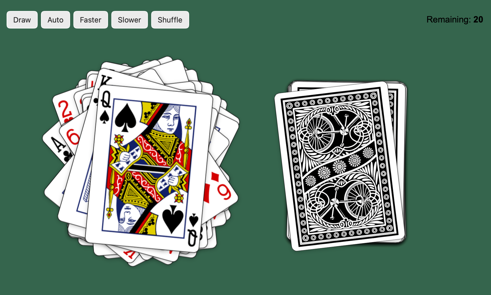

# Deck of Cards

A React app that draws and shuffles playing cards using the [Deck of Cards API](https://deckofcardsapi.com). Cards fan out with random transforms and respond to hover with nudge effects.

**[Live Demo](https://perkolatte.github.io/deck-of-cards-react/)**



## Features

- **Draw** — pull one card at a time from a shuffled 52-card deck
- **Auto Draw** — toggle automatic drawing at an adjustable interval (200ms–3000ms)
- **Faster / Slower** — change the auto-draw speed in 200ms steps
- **Shuffle** — return all drawn cards to the deck and reshuffle
- **Hover effects** — drawn pile scales up and nudges cards; deck cards nudge individually
- **Touch effects** — tap nudge radiates from the touched card with distance-based decay
- **Responsive** — fluid card sizing with `aspect-ratio` and `clamp()` across all viewports
- **Accessible** — keyboard navigation, semantic landmarks, ARIA labels, focus-visible outlines

## Tech Stack

| Tool              | Version                          |
| ----------------- | -------------------------------- |
| React             | 18.2                             |
| Vite              | 7.3                              |
| Deck of Cards API | v2                               |
| GitHub Pages      | via `peaceiris/actions-gh-pages` |

## Project Structure

```
src/
├── App.jsx                  # Root component — state, handlers, auto-draw logic
├── main.jsx                 # React entry point
├── assets/
│   └── back.png             # Card back image
├── components/
│   ├── Controls.jsx         # Buttons, speed controls, remaining count, error
│   ├── Deck.jsx             # 52 face-down card images with hover nudge
│   └── DrawnCards.jsx        # Drawn card pile with hover scale + nudge
├── styles/
│   └── style.css            # All styles — layout, cards, responsive, a11y
└── utils/
    ├── api.js               # API wrapper (createDeck, drawFromDeck, shuffleDeck)
    └── transforms.js        # Random transforms, nudge helpers, card styles
```

## Getting Started

```bash
npm install
npm run dev
```

Open [http://localhost:5173](http://localhost:5173).

## Build & Deploy

```bash
npm run build    # outputs to dist/
npm run preview  # preview production build locally
```

Pushes to `main` automatically build and deploy to GitHub Pages via the workflow in `.github/workflows/deploy.yml`.

## License

ISC
